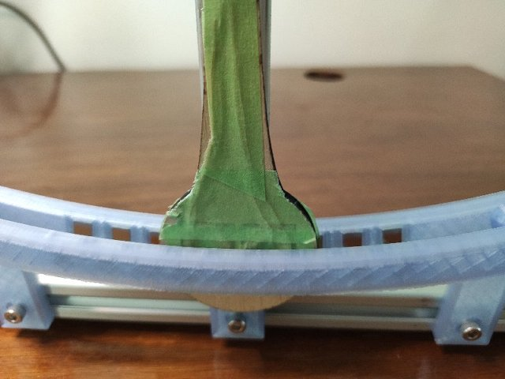

# theClock - my first attempts at making a electromagnetic wooden geared clock

THIS PROJECT IS OBSOLETE.  Please see [**theClock3**](https://github.com/phorton1/Arduino-theClock3)
for a more functional, and better documented electromagnetic wooden clock for **makers**.

This project is being documented *posthumously* in order to preserve the lineage of my clock oriented projects.

## When and Why?

Around November of 2022, I had completed the [**20 mm CNC machine**](https://github.com/phorton1/Arduino-esp32_cnc20mm)
project and was using that machine to create various wooden boxes and other projects.  I was having fun with
the laser cutting capabilities of the machine and decided I wanted to try something with wooden gears in it.
After a few weeks of mulling the kinds of things I could build with wooden gears ... novelty boxes, or maybe
wooden robots, cars, etc ... I hit on the notion of making a **wooden clock**.

So I began obsessing about clocks in general and wooden clocks in particular.  One prolific online source
of information is [**Brian Law**](https://www.woodenclocks.co.uk/) and his many clocks, webpages and designs.
Although not wooden, I quickly found [**Steve Peterson's**](https://www.youtube.com/@stevesclocks)
series of 3D printed clocks interesting.  I explored dozens of existing designs, from the most artistic,
to the most rudimentary simple escapement mechanisms.

My diode laser cutter is limited to cutting about 1/4" (or less) wood.

As it turned out, I could not find a single existing design that I could make using
the tools and materials I had available to me.  My goal was to **laser cut** most of the pieces
from thin, cheap, available plywood and possibly 3D print a few other parts.   This is not
to dis any of the many great, and complete, and sometimes free designs out there.  But, I
actually live in an apartment, don't have access to a table saw or similar typical woodworking
tools.  Most of the designs for clocks that I found online involved thicker woods, typically hardwoods,
and the use of the usual woodworking tools.

Although you can find a number of *clock
making kits* that use laser cut plywood **for sale** online, I could not find any free
online designs for such clocks.  Finally, with regards to the existing laser pre-cut
kits that *are* available, even for pay, none of them captured what I was trying to achieve.
Although beautiful and complex, the available *kits* are more or less uniformly intended as
snap-together novelty clocks and not really designed to be permanently constructed and
act as actual time pieces.

So, I determined I would just learn what was necessary and design my clock from scratch.

Probably the first requirement that I arrived at was that I wanted the clock to be
electromagnetically driven. The real study and discipline of
[**Horology**](https://en.wikipedia.org/wiki/History_of_timekeeping_devices),
and clocks as we know them, centrally involves the evolution of
[**gravity escapement mechanisms**](https://en.wikipedia.org/wiki/Escapement#Deadbeat_escapement).
But I did not want to build a clock that had to be rewound (or it's weight lifted) every day or week.
I wanted something I could put on a shelf, and forget, and that would keep time fairly
reliably ... that is that it would function as an actual clock in my living space.

So I elected early to have an electromagnetically driven pendulum, while maintaining
the idea that it would have wooden, laser cut gears.

I thought it would be *so much easier* than it turned out to be!  In fact, my original
notion was to build a **chaotic clock** that, despite being chaotic, still kept accurate time, an idea I
may yet revisit.  The idea was to build a dual pendulum clock that could be intentionally
driven into a chaotic motion, but that could be recovered to periodicity at
small amplitudes, and then to have the clock randomly intersperse chaotic movements
of the pendulum with regular time-keeping movements to correct and adjust for
the chaos.  It was to be called **The Perception of Time**, alluding to the fact
that humans just do not experience time in a linear manner. Also, in my dreams,
it would be artistic and/or have crazy gear trains like squares, triangles, or helices.

In any case, that remains a project for the possible future as I decided that,
since I only wanted to spend a few weeks on the project, I had just better build
a simple clock.

**I had a lot to learn**

## A Few Requirements

As with all of my projects, I started off by listing a few requirements for the project.

- It would largely be made of **thin laser cut plywood** (as described above)
- It would use an **electromagnetically driven pendulum**
- It would have concentric **hour**, **minute**, and **second hands**
- It would keep **reasonably accurate** time, the definition of which was yet to be determined.
- It would **not** look like, or be constructed like a **snap together kit**.
- It would look like a **permanent construction** .. a *real clock*, yet ....
- It would be built in such a way that it could be **disassembled** and **repaired** or **modified** if necessary
- It would make use of an **MPU** (Microprocessor) like an Arduino or an ESP32
- It would have a custom made **PCB** (Printed Circuit Board)
- The PCB and electromagnetic coils would be hidden, unobtrusively powering the clock
- The **magnet** on the pendulum would **pass between two coils** rather than *over one coil* (discussed below)

The requirement about being able to be **disassembled** and and **repaired** or **modified** warrants
a brief discussion.

Especially since I had no idea if the clock would even work, or what refinements might be needed,
I decided to design the clock in such a way that, as much as practicable, I would be able to disassemble
and re-assemble it multiple times in case I needed to modify the mechanical aspects of the clock
along the way.   Also, not having any idea about the lifespan of
such a clock, it was important to me to be able to, at some point in the future, disassemble and
repair and/or rebuild the clock in case the gears or parts of the wooden mechanism
*wear out*.

Given a general idea of the requirements of the project, I then proceeded into a **research
phase** to learn as much as possible about these kinds of clocks before constructing one.
I downloaded and analyzed virtually any clock design that I could, even if they did not
match my construction criteria, just to get an idea of how other people had approached
building wooden (or any) clocks.  This included a number of complete **Fusion 360** designs,
but also a number of available (free) online **books** about the subject.

## Electromagnetism and Gravity

It was a wonderful journey!   I spent days, and sometimes all night, reading histories
and perspectives of clock making, which turn out to be pretty fundamental to science,
and the development of civilization as we know it.  The **research phase** broadened
out into a review, as it were, of pretty much **the entire history of science** lol.

It led me to re-touch my basic understandings of **physics** and **mathematics**,
going back through **Newton** and *Calculus 101*, but really took me on a journey
through most of human history.   From sun dials, to the Aztecs and their calendars,
Pythagoras and the Greeks, I was all over the place reading about the history of how humans
came up with the notion of time ... and measuring it.

Galileo famously notices the period of a [**pendulum**](https://en.wikipedia.org/wiki/Pendulum)
is nearly independent of it's amplitude ... that is that a pendulum swings at about
the same rate regardless of how wide it swings.
[Christiaan Huygens](https://en.wikipedia.org/wiki/Christiaan_Huygens) creates
a gravity escapement mechanism to produce the world's most accurate clock
of the 1600's ... accurate to a few minutes a day.

One of my favorite reads was learning more about
[Robert Hooke](https://en.wikipedia.org/wiki/Robert_Hooke), the
creation of the [Royal Society](https://en.wikipedia.org/wiki/Royal_Society),
and Hooke's rivalry with Issac Newton.  **Did you know that Robert
Hook was the first human to ever create a tone of a known frequency?**
LOL, he created a gear mechanism with a paper card, and by knowing
the gear ratios and counting off the seconds with a clock, he could
ascertain the frequency of the resulting tone.

It was approximately a G# lol, on his piano, in case you're wondering,
although the **tuning fork** would not be invented for another 150 years,
and the semi world-wide standardardization to A440 tuning until the
middle 1900's - after WW1.

In any case, or rather, of course, that led me through the whole
[Age of Enlightment](https://en.wikipedia.org/wiki/Age_of_Enlightenment)
before I could relish re-learning about the greats in the discovery
and understanding of [Electromagnetism](https://en.wikipedia.org/wiki/Electromagnetism).
Volta!  Gauss!  Ampere!  Lorenz!  Michael effing Faraday!

**And then came [Maxwell](https://en.wikipedia.org/wiki/James_Clerk_Maxwell)**

All of sudden we're talking about **the speed of light** !!!

Another fun fact: **Did you know that [Michelson](https://en.wikipedia.org/wiki/Albert_A._Michelson)
and [Morely](https://en.wikipedia.org/wiki/Edward_W._Morley) used a *pendulum* in their
groundbreaking attempts to measure the speed of light?** Yup.  They used one to determine
the local gravity in Pasadena, CA, which was part of their calculations of the speed of
light.

In any case, all of this stuff was very interesting, and I got to re-learn
a lot, and learn a lot of new stuff as I started designing silly wooden clocks!

## Experiments - Pendulum Prototypes

I thought it would be a good idea to just build a pendulum and see if I
could get it to swing with an electromagnet.   I 3D printed a little
white pendulum that was about 5 inches high and using some coils removed
from a couple of of micro-solenoids I had laying around. I
created a circuit with an Arduino and a motor controller module
to send pulses of electricity to the coils.

That worked in a few hours.  The pendulum had a magnet in it, and
could be made to swing back and forth (fairly rapidly).

Then I designed and built a bigger pendulum, learning in the process that
I'm not so bright!   LOL.

I thought I would make a [**linear motor**](https://en.wikipedia.org/wiki/Linear_motor)
(I was still clinging to the *chaotic pendulum* idea),
so that I could swing the pendulum really fast, or really slow,
or even stop it in the middle of a swing.   Since magnets
are cheap, and coils are expensive (and fairly hard to make), and since
most linear motors **move the coil** through stationary magnetic fields,
that was my initial stab.

I designed the Pendulum in Fusion 360.  I salvaged the magnet wire
from the transformer of an old wall wart and hand wound the coils.  I laser cut
the pendulum from wood and 3D printed the plastic framework to go on some
2020 aluminum extrusions.
I put **two coils** on the pendulum and had it swing through the fields of a
series of magnets, and extended the bread boarded **Arduino** control circuit,
thinking I could then simply control it's position
in real time as one would with a linear motor.

**Nope**.

I got it moving, but it turns out that (a) the pendulum wants to swing at a particular rate;
it did not want to move at arbitrary frequencies,
(b) you basically don't want a bunch of wires and junk on the pendulum,
as that decreases it's accuracy, and, perhaps more importantly,
in my configuration (c) the electromagnetic coils were not nearly strong
enough to stop and hold the pendulum at any given point, (d) this linear
motor was at best, like a stepper motor, and the motion was jerky and
not smooth.

Before moving on, I removed the magnets, one at a time, in a series of experiments,
until I ended up with a single magnet and the two coils on the pendulum that
I could sort of control.  At that point, though I could get the pendulum to swing
fairly reliably, I could not really control it's period.

Another thing I *did* experiment with here was using the Arduino to not only
**pulse the electromagnet** to attract or repulse the magnets
and move the pendulum, but was also to **use the coil as a
sensing device**.   Since a coil moving through a magnetic field
creates a current, I could measure that current with the
computer and tell, for example, when the coil passed a magnet.

Most single coil electromagnetic clocks use that current sensing
capability (and a simple circuit) to detect a zero crossing for
the timing for delivering the repulsive impulse to keep the pendulum
moving.

After a few days I decided to just go ahead and start designing the
gears and things for a wooden clock.

## First (Bad) Design

Designing the gears and mechanics in Fusion 360 was not difficult, but
was time consuming.

Somehow I landed on the notion that my clock would have
four coils (two about the center of the swing and two at
the extremes) -- which are really eight coils since, in
my design, the magnet moves **between** the coils.

*Another side note:  I could find absolutely **no scientific studies**
or analyses about the effect of a magnet moving **between** two coils.
There were plenty of scholarly articles on solenoids, coils,
magnets moving near a coil, etc, but nowhere could I find an analysis
of the math involved when a magnet passes **between** two coils.*

I wanted my magnet to pass **between** two coils, rather than **over**
a single coil, as most magnetic clocks do, because I felt that the
**vector of force** from a coil underneath a magnet would tend
to make the pendulum **bump** as the impulse is applied.  The
force would not be **orthogonal** to the pendulum's axis of rotation.
By having the magnet move between the two coils, the majority of
the force would be put into moving the pendulum along it's line
of travel, rather than *up* or *down* (assuming the pulse is
applied shortly after the *zero crossing*) and that seemed
**more efficient** to me.

I was also *not thrilled* with the technique of **using the
coils as sensors**.   I did experiment with it extensively,
and it works, but it is onerous in the circuit and code to change the
Arduino's pins from **input** to **output** to be able sense milliamp
currents one millisecond, and then deliver 1/2 amp or more to the same coil
a few milliseconds later and the results were not that great.

Because I knew I would want to **know where the pendulum was** in it's
swing (particularly zero crossing), and I did not like the *coil sensing*
approach, in this initial design, because I had a few on hand,
I also added [**five hall sensors**](https://en.wikipedia.org/wiki/Hall_effect_sensor),
which are electrical components that can tell when a magnet is near
them, bracketting the four (pairs) coils with the idea that
I could use the information, particularly the zero crossing, but
also the extent of the swings, in controlling the clock..

Mind you, I still don't have any idea if, or how this thing is gonna work.

But in building the test rig above, I finally determined that I needed **some kind
of an actual full clock** to even test these concepts.  The **friction**
from the gears and the work that needs to be done, the **ratchet** mechanism,
the **length and weight of the pendulum**, all play a role in how fast
the clock ticks and how much force is needed to move the pendulum.

So I just designed and built a damned clock lol, pressing through the
design even if I was not sure about if, or how, it would work.

An actual full implementation allowed me to test the simple mechanics,
gears, gear ratios, the ratchet mechanism, and so on, all of which worked
**pretty good**, more or less, on the fist build, right out of the
design gate, as it were.

I also made a **coil winding machine**, as hand winding
these coils is really tedious and inexact, and I had to
make ten of them!!

I started off using an **Arduino** on a breadboard as the computer, but
quickly decided that I would rather have a more powerful and sophisticated **ESP32**, not
only because it's speed would allow me a lot more flexibility in the
implementation, but also because the ESP32 **includes WiFi and a built in RTC**
(real time clock), whereas the Arduino doesn't.  The RTC
would come into play to keep the clock accurate, and with the WiFi I would
be able to access **NTP** (Network Time Protocol) as well as provide a **WebUI** for
remote **control, monitoring, and debugging** of the clock.

So I also designed a circuit for an ESP32 and built the first custom PCB
for the clock.  With 4 (pairs of) coils, sigh, I used **two L293D** H-bridge
motor drivers so that I could control each (pair of) coils to either
repulse or attract the pendulum magnet under MPU control.

I got it going ... it ticked and tocked .. and the second
hand moved, but the clock was not even close to keeping good time

I called this version 1.0.

## Simplifying and Getting it working (sort of)

Without going into too much gruesome detail, I quickly learned that
having so many coils was a headache and did not really help me to
control the pendulum and it's timing.  What I needed was a single,
bigger, and more powerful coil, so I retrofitted the clock with
a single bigger coil.

I also ended up *embedding the coils in epoxy* so that I could eliminate
the plastic (on the *bobbin*) between the coil and the magnet to
reduce the distance and increase the force.  Even 1mm of distance
less increased the force applied to the pendulum significantly.

### Adding the magnetic spring

As I said, I thought it would be easier.  With my 4 coil design I had
been planning to control the frequency of the pendulum by using the
outer pair of coils to either attract, or more likely repulse, the
pendulum on each swing so that I could speed it up or slow it down.

That also proved difficult to impossible, in practice, for me to accomplish.

I hit on the idea of controlling the frequency **BY** controlling
the amplitude at about that time.    **If I just had a spring ...**

hmmm ... what if I just have **one coil** and put a set of permanent
magnets near the extreme of the swing that repulse the magnet in the pendulum?
Then wouldn't it be the case that on wide swings the pendulum would **bounce**
off those springs, making it go faster?   And then couldn't I reduce the
amplitude of the pendulum (by putting less energy into it) so that it would
not bounce of the springs, and would then tick slower as a result of that?

So I retrofitted the clock with these **magnetic spring** thingees,
switched to a single coil, rewrote most of the software, and within
a week or so of the first build, I had achieved a clock
that could sort of keep time.

I called this **version 1.1**.

## Version 2

I spent a lot of time messing around version 1.1, particularly
mucking around with the code.

It was not pretty.  There is a PID controller
that adjusted the energy put into each swing based on the
milliseconds error, but I also need to add a few "heuristics" (**kludges**)
to keep the clock running reasonably ... to prevent it
from "stalling" while trying to slow down, or banging back and
forth while trying to speed up.

After a week of effort, Version 1.1 was probably accurate to a few minutes a day.

Since I wanted to make a clock as a gift to someone for Christmas,
I did one more quick design pass to rectify the worst problems with Clock1
and pressed on with another build:

- the wooden frame was not square and the clock did not sit flat,
  so I designed a 3D printed base which at least kept the clock
  itself from rocking back and forth
- I formalized the design of the magnetic springs so that they
  could be more accurately adjusted.
- I designed and built a **new PCB** that only used one LM293D
  motor controller
- I added a **face** with numbers to the clock.

I laser cut a whole new clock, and all the parts, 3d printed stuff,
made the new circuit board, soldered it up, wound coils, sanded all the gears (pain!),
painted everything, and so on, put it together, and, after putting
it through a quick testing cycle, I sent it away.

I would say that it was accurate to a few minutes a day at it's best.

I did not even get a chance to test it for a week before gifting it :-(

Nor had I, in the code, gotten around to any notion of utilizing
the ESP32's RTC (real time clock), much less to using NTP (Network
Time Protocol) to make the clock accurate over any time scales
(though I had laid the groundwork in the code, WebUI, etc)

It just tried to beat at 1000ms per swing.

I called this "theClock - Version 2"

## Design problems with Versions 1 & 2

Part of it was the mechanics .. it was missing beats or sometimes
grabbing two gears.  There were friction problems, and, I think,
misalignment causing the gears to bind at time. But also
part of it was the software and heuristics, which
were hamstrung with the *information* available to the software in
order to control the pendulum, and somewhat hastily written
and not really that well tested.

From these initial clocks I came up with the following list of **problems**:

- The use of **dowels** to connect the different **planes** of the clock did not work well.   If the dowels
  were fitted into thick pieces of hardwood, and the holes were drilled square, then the dowels could
  facilitate a **square frame**.  However, because the holes are merely in thin pieces of plywood,
  the dowels were not inherently square to the frame.  In other words, there were alignment issues
  between the *planes* of the clock, which caused **a lot of friction** and **binding of the clock**
  as the hands and gears turned.    This was particularly true when taken with the requirement that the
  clock be **disassemble-able** and the clock was only **screwed** together in the final assembly.
  To get it to work, I had to *dry build** the clock, twist the dowels and position the planes
  the best I could, **apply epoxy glue**, and then literally hold it together with my hands as the glue set
  in order to achieve any degree of alignment.
- The **ratchet mechanism** requires the pendulum to do **all of it's work** while swinging in one
  direction, and does **no work** while swinging in the other direction.  This made the pendulum
  swing (and forces involved) **lopsided** and caused an uneven beating of the clock. It would
  swing much more, and more easily, to one side than to the other.
- More importantly, the **ratchet mechanism** is directly coupled the pendulum to the pawls, so
  that **the wider the pendulum swings, the further the second hand moves**!!  This resulted
  in the mechanism being unreliable, particularly to the degree that I was trying to control
  the **frequency** of the pendulum by increasing or decreasing the **amplitude** of the swing.
  I found that, at wide swings, the pawl would sometimes **grab two teeth** and advance the clock
  **two seconds** at a time, or arguably worse, in smaller swings it would sometimes **fail to move
  the seconds hand at all** (a condition I called a **stall**).
- The five **Hall Sensors** did not provide me with enough **resolution** about the position
  of the pendulum to implement a good **PID Controller** (algorithm for controlling the clock),
  and as a result, the swing would vary wildly while trying to speed up or slow down the clock,
  sometimes banging the left and right limits of travel (and grabbing two teeth!) or other times
  failing to even grab a tooth and move the seconds hand (stalling).

Although I compensated for the last problem by putting heuristics into the code for these cases,
in subsequent clocks I utilized a different, more accurate way of sensing the position of the pendulum
which led to a much simpler algorithm, and smoother and more precise control of the
pendulum, in turn resulting in a much more pleasing and consistent swing.

### Postscript

After I built [**theClock3**](https://github.com/phorton1/Arduino-theClock3), I felt bad
for my old forlorn clock version 1 sitting there on the shelf, so I retrofitted it with
the **AS5600 angle sensor** and **software** from *theClock3* resulting in it *keeping
much better time* and having a *much nicer swing* (even though it is not as accurate,
or trouble free as *theClock3*) ..

### **Next:** After versions 1 & 2, I designed and implemented [**theClock3**](https://github.com/phorton1/Arduino-theClock3)
